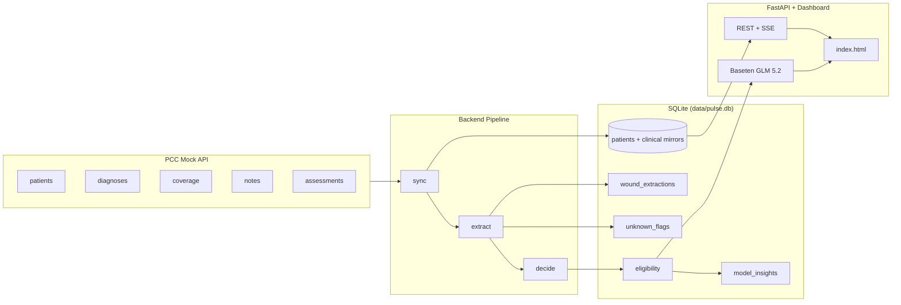

# Pulse — ABI Wound Care Eligibility: Full Project Guide

This document describes everything built in this project: how data flows from the PCC API to billing decisions, how unknowns are handled, how the ML model fits in, and how the dashboard works.

---

## 1. What This Project Does

**Pulse** is an **ABI Wound Care Eligibility Dashboard & Data Quality Engine** built on top of the [Hackathon ABI Frameworks](https://github.com/Subhradeep246/Hackathon-ABI-Frameworks) mock PCC API.

It answers one question for skilled nursing billers:

> *Should this patient be **auto-accepted**, **flagged for review**, or **rejected** for Medicare Part B wound care billing — and why?*

The system:

1. **Ingests** patient clinical data from the PCC API (with rate-limit handling)
2. **Extracts** wound measurements and metadata from unstructured notes and structured assessments
3. **Tracks unknowns** explicitly (missing, unparseable, or conflicting fields)
4. **Routes** each patient using deterministic eligibility rules
5. **Trains** an advisory decision tree (Colab / local) on rule-derived labels
6. **Serves** a live web dashboard with AI-powered billing summaries (Baseten GLM 5.2)

**Source of truth for routing:** the **rules engine** (`backend/eligibility/rules.py`). The ML model is **advisory only** — it never overrides hard rules.

---

## 2. Architecture



### Repository layout

| Path | Purpose |
|------|---------|
| `schema/schema.sql` | SQLite schema (Postgres-portable) |
| `backend/ingestion/client.py` | Async PCC API client, 429 retry, pagination |
| `backend/pipeline.py` | Sync → extract → decide orchestration |
| `backend/extraction/parser.py` | Regex + JSON wound parsing, unknown statuses |
| `backend/eligibility/rules.py` | Medicare Part B routing rules |
| `backend/api/main.py` | FastAPI app, dashboard API, SSE, chat |
| `backend/llm.py` | Baseten GLM client (summaries + chat) |
| `backend/jobs.py` | Background auto-sync, progress tracking |
| `backend/ml_apply.py` | Apply trained model to `model_insights` |
| `frontend/index.html` | Single-page biller dashboard |
| `ml/train_model.py` | Decision tree training script |
| `ml/models/decision_tree.joblib` | Trained model artifact |
| `data/pulse.db` | Local SQLite database |

---

## 3. End-to-End Data Flow

### Step 1 — Sync (`run_sync`)

For each facility (default **101, 102, 103**):

1. `GET /pcc/patients` — upsert into `patients`
2. For each patient (concurrent, semaphore-limited):
   - `GET /pcc/diagnoses`
   - `GET /pcc/coverage`
   - `GET /pcc/notes`
   - `GET /pcc/assessments`
3. Upsert each record with `ON CONFLICT(patient_internal_id, source_id)`
4. Track progress in `sync_runs` and `facility_sync_status`
5. On full success, update `sync_watermarks` for incremental sync

**Scalability features:**

- Per-patient DB sessions (no shared-session contention)
- Batch commits every 25 patients
- Global API semaphore + tenacity retry on 429/5xx
- Paginated patient fetch when API supports `limit`/`offset`
- Incremental sync via `sync_watermarks.last_success_at`
- Configurable: `FACILITY_IDS`, `SYNC_CONCURRENCY`, `API_PAGE_SIZE`

### Step 2 — Extract (`run_extract`)

1. Clear prior parse flags (`wound_extractions`, parse-related `unknown_flags`)
2. For each **current** note (`is_current=1`):
   - Detect format: `soap`, `prose`, `envive`, `multi_wound`, `unknown`
   - Parse wound fields via regex
   - Insert `wound_extractions` with per-field status
   - Flag `envive_narrative_only` if Envive-style narrative detected
3. For each **current** assessment with `status='Complete'`:
   - Parse structured JSON wound fields
   - Insert `wound_extractions`

### Step 3 — Decide (`run_decide`)

For each patient:

1. Load diagnoses, coverage, wound extractions, unknown flags
2. Detect note vs assessment **stage conflict**
3. Detect **multiple active payers**
4. Call `decide()` → insert row into `eligibility`
5. Insert conflict / payer flags into `unknown_flags`

### Step 4 — ML apply (optional, `apply-model`)

1. Load `ml/models/decision_tree.joblib`
2. Predict per patient → `model_insights` (suggestion, probability, rule agreement)

---

## 4. Database Schema (Key Tables)

| Table | Role |
|-------|------|
| `patients` | Mirror of PCC patients (`patient_internal_id` PK) |
| `diagnoses` | ICD-10 codes with `clinical_status` |
| `coverage` | Payer records; **use `payer_code`**, not `payer_type` |
| `notes` | Raw note text + `note_type`, `is_current`, `effective_date` |
| `assessments` | Structured wound JSON; only `status='Complete'` is billable |
| `wound_extractions` | Parsed wound fields + per-field unknown status |
| `unknown_flags` | Data quality flags (severity: low/medium/high) |
| `eligibility` | **Final routing decision** per patient (1 row) |
| `model_insights` | ML advisory predictions |
| `sync_runs` / `facility_sync_status` / `sync_watermarks` | Sync observability |

**Important schema amendments** (vs naive design):

- `coverage.payer_code` — API uses `MCB` for Medicare B, not `payer_type = "Medicare B"`
- `diagnoses.clinical_status` — must be `active` for wound ICD checks
- `UNIQUE(patient_internal_id, source_id)` on mirror tables for idempotent upserts
- `notes.is_current`, `assessments.is_current` — only current records are extracted

---

## 5. Wound Extraction & Unknown-Aware Framework

Every extracted wound field has a **status**, not just a value:

| Status | Meaning |
|--------|---------|
| `known` | Successfully parsed |
| `unknown_missing` | Field not present in source text |
| `unknown_unparseable` | Text present but could not be parsed reliably |

### Note formats detected

| Format | Detection |
|--------|-----------|
| `soap` | `Location:` and `Wound type:` labels |
| `prose` | Free-text with `L x W` measurements |
| `envive` | "Envive" or "care conference review" style narrative |
| `multi_wound` | Multiple stage/pressure ulcer mentions |
| `unknown` | Fallback |

### Wound types recognized (regex)

`pressure_ulcer`, `diabetic_foot_ulcer`, `venous_stasis_ulcer`, `arterial_ulcer`, `surgical_site_infection`, `abscess`, `burn`

### Unknown risk score

Computed in `compute_unknown_risk()`:

- **Flags:** low +5, medium +15, high +25 per flag
- **Field statuses:** missing +5, unparseable +10, conflict +20 per field
- **Tier:** green (&lt;20), yellow (20–49), red (≥50), capped at 100

This score feeds both routing (`flag_for_review` if red) and ML features.

---

## 6. Eligibility Rules — How Routing Is Determined

Routing produces one of three decisions:

| Decision | Meaning for billers |
|----------|---------------------|
| `auto_accept` | Documentation complete — safe to proceed |
| `flag_for_review` | Missing data, conflicts, or high unknown risk |
| `reject` | Does not meet Medicare Part B criteria |

### Decision tree (rules engine)

```
START
  │
  ├─ No active Medicare Part B (payer_code = 'MCB', effective)?
  │     └─ REJECT: "No active Medicare Part B coverage."
  │
  ├─ No active wound ICD AND no documented wound in notes/assessments?
  │     └─ REJECT: "No active wound diagnosis or documented wound..."
  │
  ├─ Primary wound missing measurements (L/W), depth, or drainage?
  │     └─ FLAG: "Active wound documented but missing {fields}..."
  │
  ├─ Any of: note/assessment conflict, multiple eligible wounds,
  │           Envive narrative only, unknown risk tier = red?
  │     └─ FLAG: "Flagged for review: {reasons}."
  │
  ├─ Critical fields known (type, L, W, D, drainage all status=known)?
  │     └─ AUTO_ACCEPT: "Active {type} stage {n} at {location}..."
  │
  └─ Else
        └─ FLAG: "Clinical criteria appear met but some fields incomplete..."
```

### Medicare Part B check

```python
# Active coverage: effective_to is null/empty OR >= today
# Medicare B: payer_code == 'MCB' (NOT payer_type)
has_active_medicare_b(coverage_rows)
```

### Active wound diagnosis

ICD-10 prefixes include: `L89.*`, `E11.621`, `E10.621`, `I83.0`, `I70.*`, `T81.4`, `T81.3`, `L02.*`, burn codes `T20–T32`

Requires `clinical_status = 'active'`.

### Primary wound selection

Among all `wound_extractions` for a patient:

1. Rank by stage (2 &lt; 3 &lt; 4 &lt; unstageable)
2. Tie-break by field completeness
3. If top two tie → `multiple_eligible_wounds = true` → flag for review

### Note vs assessment conflict

If both note and assessment wounds exist and **stages differ** → `note_assessment_conflict` flag (high severity) → flag for review.

---

## 7. Pipeline Results (300 Patients)

After full pipeline on the hackathon dataset:

| Routing decision | Count |
|------------------|-------|
| `auto_accept` | 15 |
| `flag_for_review` | 129 |
| `reject` | 156 |
| **Total** | **300** |

Facility 101 has **120** patients (not 100). Sync may report `partial` if some 429 rate limits occur, but all 300 patients were ingested in our runs.

---

## 8. Machine Learning (Advisory Only)

### Purpose

Train a **shallow decision tree** to predict whether the rules engine would `auto_accept` a patient. Used for:

- `model_insights` table in the dashboard
- Demonstrating ML on Colab A100
- Comparing model vs rules (agreement flag)

**The tree does NOT override routing.** Rules always win.

### Training

```bash
python backend/cli.py export-features   # → ml/exports/features.csv
python ml/train_model.py --features ml/exports/features.csv --out ml/models/decision_tree.joblib
python backend/cli.py apply-model
```

Or use `ml/train_colab.ipynb` / `ml/train_colab_oneclick.ipynb` on Colab Pro (A100).

### Features (13)

`facility_id`, `has_active_medicare_b`, `unknown_risk_score`, `unknown_flag_count`, `note_assessment_conflict`, `multiple_eligible_wounds`, `envive_narrative_only`, `length_cm`, `width_cm`, `depth_cm`, `active_dx_count`, `note_count`, `assessment_count`

### Target

Binary: `1` if `routing_decision == 'auto_accept'`, else `0`

### Model config

- `DecisionTreeClassifier(max_depth=4, min_samples_leaf=15, class_weight='balanced')`
- 80/20 stratified split, 5-fold CV
- Logistic regression baseline for comparison

### Accuracy (current model, 300 rows)

| Metric | Value |
|--------|-------|
| **5-fold CV accuracy** | **84.0%** |
| **Hold-out test accuracy** | **78.3%** |
| **Logistic baseline** | **91.7%** |

### Top feature importances

| Feature | Importance |
|---------|------------|
| `has_active_medicare_b` | ~50% |
| `unknown_risk_score` | ~31% |
| `width_cm` | ~13% |
| `depth_cm` | ~6% |

The logistic baseline scores higher because labels are rule-derived and Medicare B + unknown risk already separate classes strongly.

---

## 9. Dashboard & API

### Running locally

```bash
cd Pulse
python3 -m venv .venv && source .venv/bin/activate
pip install -r backend/requirements.txt
cp .env.example .env   # add BASETEN_API_KEY

uvicorn backend.api.main:app --reload --port 8000
# → http://localhost:8000
```

### Auto-sync (no manual refresh)

On server start:

- **Auto-sync** runs incrementally (`AUTO_SYNC=true` by default)
- Repeats every **300 seconds** (`SYNC_INTERVAL_SECONDS`)
- Dashboard updates via **SSE** (`GET /api/events`) — no reload button needed

### Key API endpoints

| Endpoint | Description |
|----------|-------------|
| `GET /api/health` | Liveness + patient count + Baseten status |
| `GET /api/dashboard` | Stats + patient page in one fast call |
| `GET /api/stats` | Aggregates by decision, facility, last sync |
| `GET /api/patients` | Filtered, paginated list (limit up to 500) |
| `GET /api/patients/{id}?with_summary=true` | Detail + Baseten AI summary |
| `POST /api/chat` | Baseten GLM billing Q&A |
| `GET /api/events` | SSE stream for live updates |
| `POST /api/sync` | Manual pipeline trigger (optional) |
| `GET /api/sync/status` | Background job progress |

### Dashboard UX

- **How it works** guide at top (decision legend)
- Filters: facility, decision, risk tier, search
- Pagination: 25 / 50 / 100 per page
- Click patient → AI summary (Baseten) + rule reason + data gaps
- Billing assistant chat (Baseten GLM 5.2)
- Live status dot + sync progress bar

---

## 10. Baseten GLM 5.2 Integration

Configured in `.env`:

```env
BASETEN_API_KEY=your_key
BASETEN_BASE_URL=https://inference.baseten.co/v1
BASETEN_MODEL=zai-org/GLM-5.2
```

### Where Baseten is used

| Use case | Module | Behavior |
|----------|--------|----------|
| **Patient summary** | `backend/llm.py` → `patient_summary()` | Auto-generated on patient click; cached 120s |
| **Billing chat** | `backend/llm.py` → `chat_answer()` | Q&A with full patient context |
| **Fallback** | Rules engine text | If API key missing, timeout, or error |

### System prompt constraints

- Answer **only** from provided structured data
- Never invent ICD codes, measurements, or routing decisions
- Explicitly state unknowns
- Concise, biller-friendly language

**Security:** Never commit `.env`. Rotate keys if exposed.

---

## 11. PCC API Field Gotchas

These caused real bugs during development — document for anyone extending the project:

| Gotcha | Correct approach |
|--------|------------------|
| Medicare B detection | `payer_code = 'MCB'`, not `payer_type = 'Medicare B'` |
| Active diagnoses | Filter `clinical_status = 'active'` |
| Billable assessments | Only `status = 'Complete'` |
| Assessment JSON | `raw_json` is often a JSON-encoded **string** — parse twice |
| Note type labels | `"Wound (SPN)"` notes may contain Envive body text — parse by **content**, not `note_type` |
| Rate limits | API returns **429** with `Retry-After` header — handled via tenacity + sleep |
| Facility 101 size | 120 patients, not 100 |

---

## 12. CLI Reference

```bash
python backend/cli.py init-db          # Create schema
python backend/cli.py sync             # Full API sync
python backend/cli.py sync --since TS   # Incremental sync
python backend/cli.py extract          # Parse wounds
python backend/cli.py decide           # Run eligibility rules
python backend/cli.py pipeline         # Incremental sync + extract + decide
python backend/cli.py export-features  # CSV for ML
python backend/cli.py apply-model      # Load joblib → model_insights
```

### Makefile shortcuts

```bash
make install
make pipeline
make serve
make dev          # pipeline + serve
```

---

## 13. Environment Variables

| Variable | Default | Purpose |
|----------|---------|---------|
| `DATABASE_URL` | `sqlite:///data/pulse.db` | Database connection |
| `PCC_BASE_URL` | `https://hackathon.prod.pulsefoundry.ai` | PCC API base |
| `FACILITY_IDS` | `101,102,103` | Facilities to sync |
| `SYNC_CONCURRENCY` | `5` | Parallel patient detail fetches |
| `SYNC_BATCH_SIZE` | `25` | Commit batch size |
| `API_PAGE_SIZE` | `500` | Patient list pagination |
| `API_MAX_CONCURRENT` | `8` | Global API request cap |
| `AUTO_SYNC` | `true` | Auto-sync on server start |
| `SYNC_INTERVAL_SECONDS` | `300` | Recurring sync interval |
| `STATS_CACHE_SECONDS` | `15` | Stats API cache TTL |
| `LLM_CACHE_SECONDS` | `120` | AI summary cache TTL |
| `BASETEN_API_KEY` | — | Baseten inference |
| `BASETEN_BASE_URL` | `https://inference.baseten.co/v1` | Baseten OpenAI-compatible API |
| `BASETEN_MODEL` | `zai-org/GLM-5.2` | Model ID |

---

## 14. Colab Training

See `ml/COLAB.md` for details.

**Options:**

1. **`ml/train_colab.ipynb`** — multi-cell; downloads `features.csv` + `train_model.py` via wget
2. **`ml/train_colab_oneclick.ipynb`** — single cell with embedded CSV (no uploads)

After training:

```bash
mv ~/Downloads/decision_tree.joblib ml/models/
python backend/cli.py apply-model
```

Regenerate one-click notebook after re-export:

```bash
python scripts/generate_colab_notebook.py
```

---

## 15. Design Principles

1. **Rules first, ML second** — routing is auditable and deterministic
2. **Unknown-aware** — every field has a known/unknown status; never silently drop gaps
3. **Idempotent ingestion** — upserts + watermarks survive retries and partial syncs
4. **Biller-readable** — dashboard and AI outputs use plain language
5. **Graceful degradation** — Baseten, API, and sync failures fall back without crashing the UI
6. **Scale-ready** — pagination, batching, WAL SQLite, SSE, slim API payloads

---

## 16. What We Built in This Session (Summary)

| Area | Delivered |
|------|-----------|
| Schema | Full SQLite schema with API-field amendments |
| Ingestion | Async client, 429 handling, pagination, incremental watermarks |
| Extraction | Regex + assessment JSON parser with unknown framework |
| Eligibility | Full Medicare Part B routing rules |
| Pipeline | sync → extract → decide on 300 patients |
| ML | Decision tree trained (78.3% test, 84% CV), applied to all patients |
| API | FastAPI with dashboard bundle, SSE, gzip, caching |
| Dashboard | Auto-sync, live updates, pagination, AI summaries |
| Baseten | GLM 5.2 for summaries + chat with fallbacks |
| Colab | Training notebooks + hosting workarounds |
| Docs | This guide, `README.md`, `ml/COLAB.md` |

---

## 17. Quick Verification Checklist

```bash
# 1. Pipeline
python backend/cli.py pipeline

# 2. Check counts
sqlite3 data/pulse.db "SELECT routing_decision, COUNT(*) FROM eligibility GROUP BY routing_decision;"

# 3. Start dashboard
uvicorn backend.api.main:app --reload --port 8000

# 4. Test chat
curl -X POST http://localhost:8000/api/chat \
  -H 'Content-Type: application/json' \
  -d '{"patient_id":"FA-001","question":"Why was this patient routed this way?"}'
```

Expected: dashboard at **http://localhost:8000** with 300 patients, live auto-sync, and Baseten summaries on patient click.

---

*Last updated: June 2026 — Pulse ABI Wound Care Eligibility project.*
